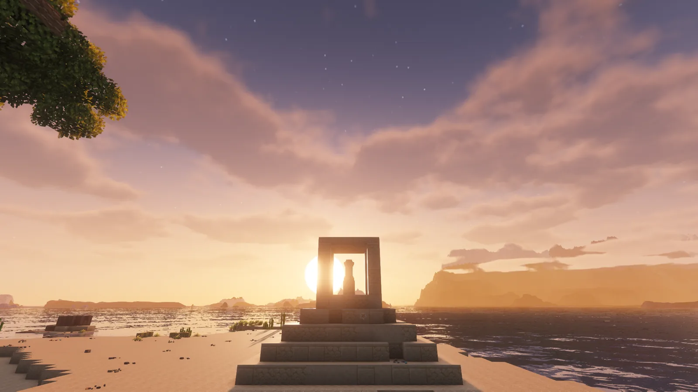
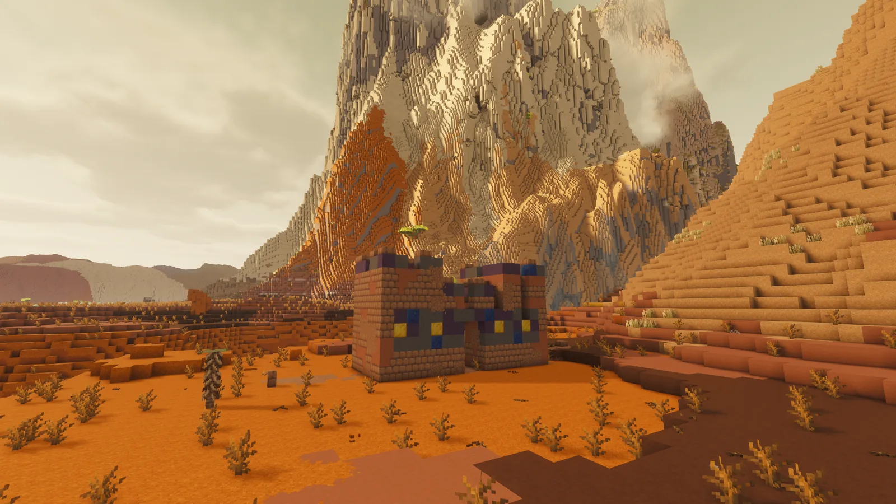
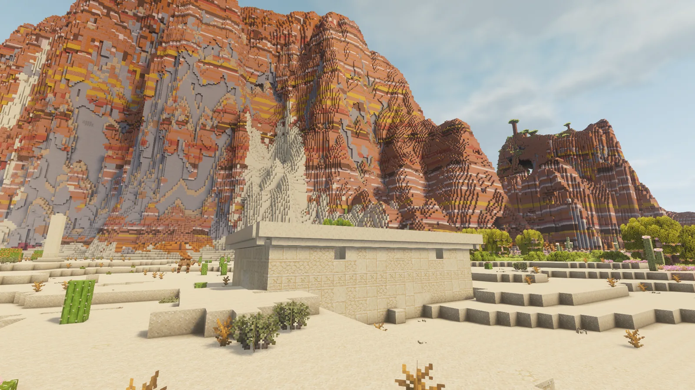
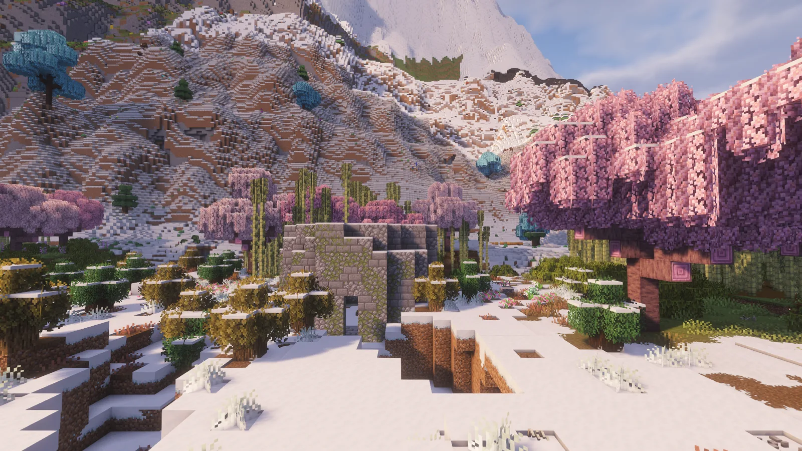
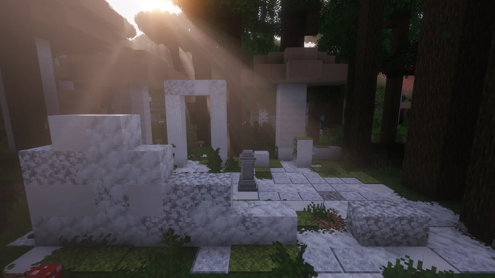

# Bons Voyage

**Discover the ruins. Reconnect the world.**

The Waybuilders are gone. Their waystones still work.

**[Download 1.19.3](https://github.com/BonsUnleashed/bons-voyage/releases/tag/v1.19.3)** for Minecraft 1.20.1 Forge · [Changelog](CHANGELOG.md) · [Build from source](BUILDING.md) · [Watch the trailer](https://github.com/BonsUnleashed/bons-voyage/releases/download/v1.19.3/bons-voyage-trailer.mp4) (70 s, in a 500-mod pack with shaders)

Requires Waystones, Balm and Lithostitched. Free, MIT licensed, client and server. Also on CurseForge and Modrinth.

Bons Voyage adds more than 190 ruins of a lost civilization to Minecraft 1.20.1
Forge. Every ruin houses a working [Waystones](https://www.curseforge.com/minecraft/mc-mods/waystones)
waystone. Some stand in the open. Others wait behind sealed doors, under courtyards,
on the sea floor, in the Nether and in the End.

**Bring a brush. Look twice.**

## What you will find

- **Roadside remains.** Arches, cairns, broken rings, well shrines and watch posts,
  dressed for six kinds of country: temperate, mossy, sandy, frozen, cherry and badlands.
- **Grand temples.** Great halls, colonnades, pyramids and courts, with hidden rooms
  behind seals, hatches and weak walls.
- **Crypts.** Four underground families: deep, lush, dripstone and sculk.
- **Sunken and drowned ruins** on ocean floors and river beds.
- **The great dungeons.** The biggest site of each school, with the deepest vaults and
  the only monster spawners in the mod.
- **Nether and End ruins**, named in tongues of their own.
- **The Origin.** The First Waystone, about one in every 1,900-block square of the Overworld.

## Five schools

The Waybuilders are fictional. Their five schools draw on real traditions, and each is
named for a stone its builders raised to mark the world:

| School | Named for | Where | Ruins |
|---|---|---|---:|
| Benben | the first stone, where the world began | Deserts and dry coasts | 15 |
| Herma | the stone heaps that marked the roads | Temperate forests, plains and cherry groves | 24 |
| Kudurru | the carved stones that kept the borders | Badlands and mesas | 11 |
| Varða | the cairns that guide travellers over the mountains | Snowfields, taiga and frozen peaks | 18 |
| Sacbe | the white stone roads through the forest | Jungles, swamps and rainforests | 11 |

A waystone activated inside a school's ruin takes a name in that school's tongue, from
337 curated names ("Sekh-Amara", "The Olive Gate", "Ishtar-Kalla", "Fjordwatch",
"The Jade Stair"). Stones outside a ruin are named by Waystones as usual.

## How it plays

1. **Read the site.** A lone marker, a wall that ends too soon, a court laid out toward nothing.
2. **Find the way in.** About a quarter of the eligible ruins conceal a room that is not on the surface.
3. **Brush for relics.** Suspicious sand and gravel hold sherds and valuables.
4. **Earn the better chest.** Four tiers: open crypt, curiosity cache, hidden treasury, Waybuilder hoard.
5. **Activate the stone** and travel with Waystones' normal rules and your own settings.

Seven advancements mark the way, from the first traces to Where the Way Began.

## Installation

For **Minecraft Java 1.20.1 with Forge 47.4.16 or newer**. Put Bons Voyage and these
Forge 1.20.1 mods in your `mods` folder, on the client and on the server:

| Required mod | Minimum version | Download |
|---|---|---|
| Waystones | 14.1.21 | [CurseForge](https://www.curseforge.com/minecraft/mc-mods/waystones) · [Modrinth](https://modrinth.com/mod/waystones) |
| Balm | 7.3.44 | [CurseForge](https://www.curseforge.com/minecraft/mc-mods/balm) · [Modrinth](https://modrinth.com/mod/balm) |
| Lithostitched | 1.4.11 | [CurseForge](https://www.curseforge.com/minecraft/mc-mods/lithostitched) · [Modrinth](https://modrinth.com/mod/lithostitched) |

Ruins appear in **newly generated chunks**. Existing terrain is not changed. Back up
your world before changing mods. If you ran an earlier Bons Voyage or Waystone Ruins
build, replace the old jar; named waystones keep their names, and the retired naming
companion is included now, so do not install it separately.

## Good to know

- **One ruin per site.** Every ruin claims the ground around it, and where two would
  meet the smaller gives way. In testing no two surface ruins stood closer than about
  150 blocks.
- **Rarity is yours to tune.** Each of the 29 structure sets has ordinary spacing and
  separation values. A datapack or a structure tuning mod such as Structurify can
  change them.
- **Modded biomes are covered.** The biome lists name more than 400 biomes from over
  twenty biome mods, including Terralith, Biomes O' Plenty, Regions Unexplored,
  Oh The Biomes We've Gone, Atmospheric and Better End, with Forge biome tags as the fallback.
- **World generation cost: none measured.** With only Forge and the three required
  mods, generation ran at the same speed with and without Bons Voyage in a six-run test.
- **Lighter site checks (1.19.3).** A ruin checks the ground at fewer points while it
  looks for a site, about half as many in fresh terrain, and sits as flat as before.
- **Removable.** Ruins already generated stay as ordinary blocks and their waystones
  keep working. The mod adds no items, blocks or dimensions.
- The mod id is `waystone_ruins`. 190 structures take part in generation; four
  older IDs stay registered so existing worlds load. The 428 templates include
  variants and attached pieces.

## Credits

Created by **BonsUnleashed**. Developed with AI assistance. Code and authored data are
released under the **MIT License**; the source and build script are included with every
release.
See NOTICE for provenance.

Thanks to BlayTheNinth for Waystones and Balm, and to Apollo and the Lithostitched
contributors for the world-generation library. Bons Voyage is an independent add-on.

## Places worth finding

| | |
|---|---|
|  |  |
|  |  |

Every image is an unedited game capture from one world inside a 500-mod pack with Complementary Unbound shaders.
